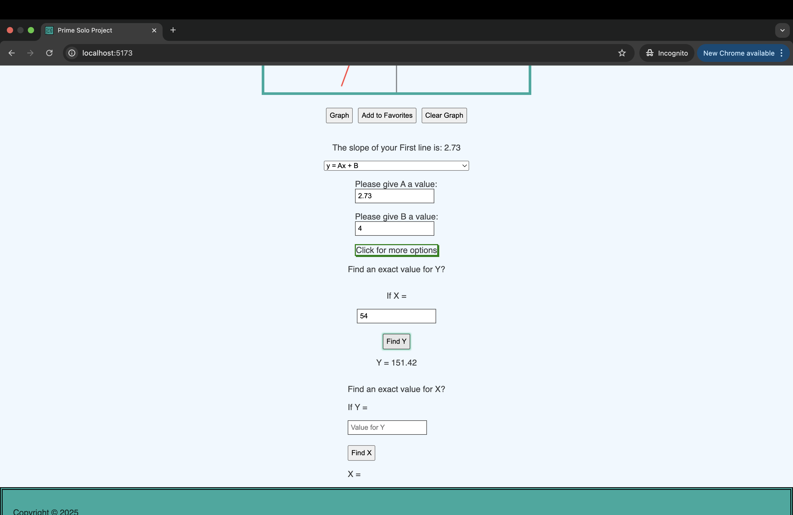

# Prime Solo Project - Starting Repo

This version uses React, Zustand, Express, Passport, and PostgreSQL. (A full list of dependencies can be found in `package.json`.)

## Prerequisites

Before you get started, make sure you have the following software installed on your computer:

- [Node.js](https://nodejs.org/en)
- [PostgreSQL](https://www.postgresql.org)
- [Nodemon](https://nodemon.io)

## Create Database and User Table

Create a new database, then create a `user` table using the query found in `database.sql`.

* Note: `pool.js` is initially configured to connect to a database named `prime_app`. If you choose your own name, you'll need to modify `pool.js` so it knows how to connect to your database.

## Initial Setup Instructions
-Please run `git clone git@github.com:Koda125/Graph-Alot-Solo-Project.git` to clone a copy of this repo.

- In this repo's **root directory**, run `npm install`.

-Please remember to run `git remote set-url origin github_username/repo_name`
and
`git remote -v # confirm the changes`
This will help avoid accidental pushes to the main branch of this project.

- In the **root directory** create an additional server and run `npm start server` and `npm run client`

-Once the above requirements are completed, please feel free to go to your browser and go to `http://localhost:5173/`

-App Usage:
The main draw of this app is the ability to click on two spots of the graph on the main page (will need to log in) and hit the graph button. 

After hitting the graph button, a line will be drawn from the first spot clicked to the second.

The app will find the slope of the given line and with the given slope, the user is able to see what values X and Y would equal at specific values.

## Why a Graphing App:
Growing up I was overly joyed by anything math and science related. In high school I took every math class that was offered, all the way to AP Calculus my serior year. I took all they offered for science classes too, and sadly, my high school did not offer AP Bio or Chemistry. During my time taking high level math, I found myself staying up late, not doing homework, but exploring all the options and functions I could use to graph every option for a two dimensional graph. From log(), to sin(), cos(), and tan(). If it wasn't for my love of math, I probably would have never found out about my love for coding. This whole project was the best of my teenage years mixed with my young adulthood, math and coding. 

## Contributing
This app is far from complete. The main feature I am struggling with is making a line based off the inputs for A, B and C go across the X and Y intercepts at the correct spot based off the input fields. Please feel free to create a feature branch if you think of something this app needs. The best part about coding is seeing how other people solve similar problems. 

